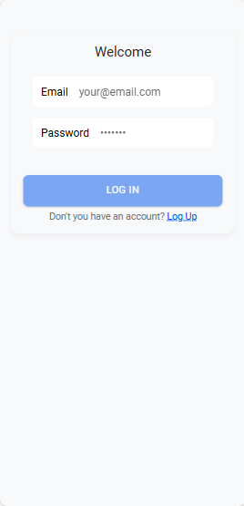
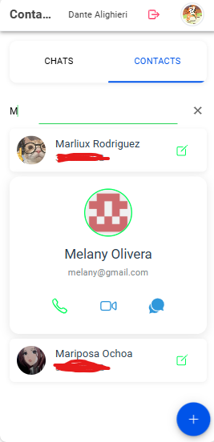
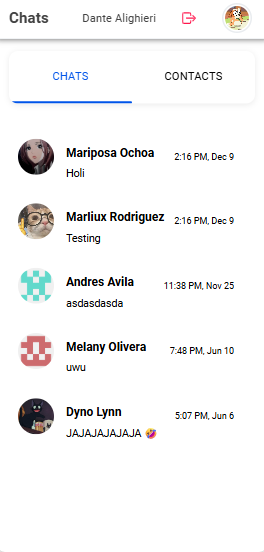
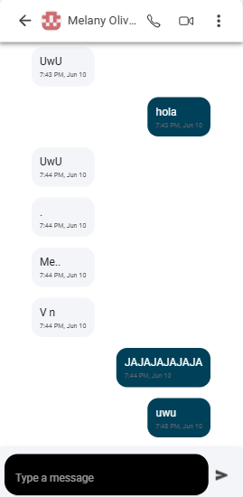
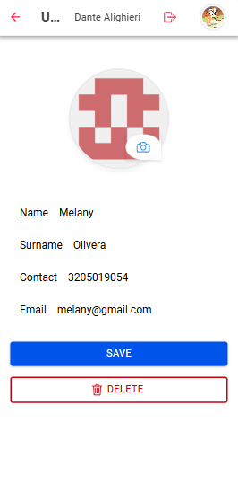

# JitCall - Modern Contact Management Platform

[](https://firebase.google.com)
[](https://angular.io)
[](https://ionicframework.com)
[](https://mit-license.org/)

A modern contact management solution with real-time synchronization and secure cloud storage.

## Features ✨

- **Contact Management**
  - Create, Read, Update, Delete (CRUD) contacts
  - Rich contact profiles

- **Security & Authentication**
  - Firebase Authentication (Email/Password, Google)
  - End-to-end data encryption
  - Session management

- **Cloud Integration**
  - Real-time sync with Firebase Firestore
  - Cloud Storage for contact media
  - Firebase Cloud Functions integration
  - Automated backups

- **UI/UX**
  - Responsive design
  - Dark/Light mode support
  - Cross-platform compatibility
  - Accessibility optimized

## Tech Stack 🛠️

**Core Technologies**
- **Frontend:** Angular 15+, Ionic 6+
- **Backend:** Firebase (Firestore, Auth, Storage, Functions)
- **State Management:** RxJS
- **UI Components:** Ionic Framework
- **Image Handling:** Cloudinary Integration

**Key Packages**
- `@angular/fire` - Firebase integration
- `@ionic/storage` - Local data persistence
- `rxjs` - Reactive programming

## Screenshots

<div align="center">    </div> <div align="center">    </div>

## Getting Started 🚀

### Prerequisites
- Node.js v16+
- Firebase account
- Ionic CLI (`npm install -g @ionic/cli`)

### Installation

1. Clone repository:
```bash
git clone https://github.com/Dandelionield/jitCall.git
cd jitcall
npm install